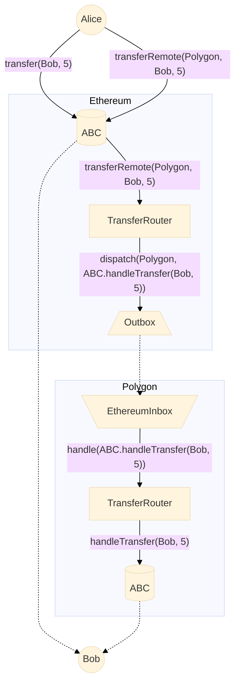
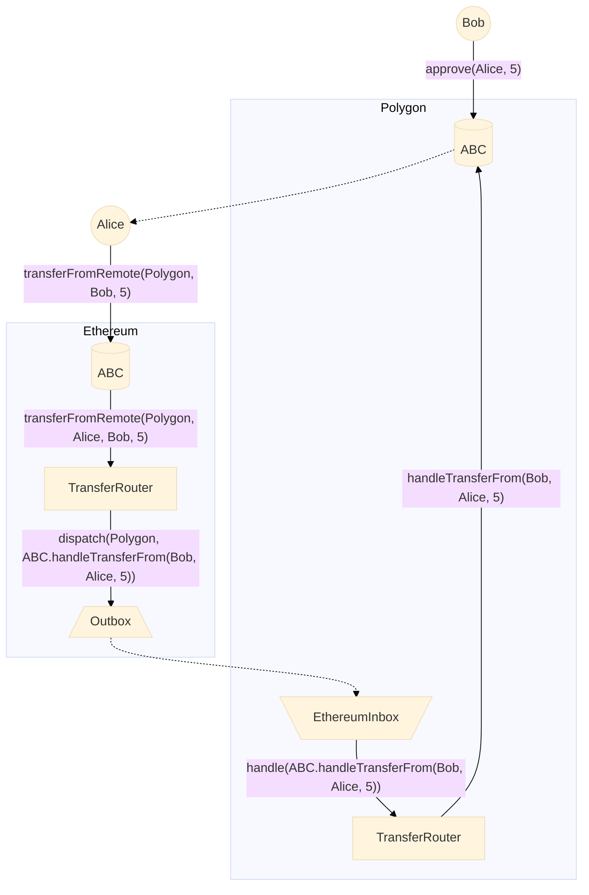

## ABC
### transferRemote

```mermaid
%%{init: {'theme':'base'}}%%
graph TB
    Alice((Alice))

    subgraph "Ethereum"
        ABC_E[(ABC)]
        TR_E[TransferRouter]
        O_E[/Outbox\]
    end

    subgraph "Polygon"
        ABC_P[(ABC)]
        TR_P[TransferRouter]
        EthereumInbox[\EthereumInbox/]
    end

    Bob((Bob))

    Alice -- "transfer(Bob, 5)" --> ABC_E -.-> Bob
    Alice -- "transferRemote(Polygon, Bob, 5)" --> ABC_E
    ABC_E -- "transferRemote(Polygon, Bob, 5)" --> TR_E
    TR_E -- "dispatch(Polygon, ABC.handleTransfer(Bob, 5))" --> O_E
    O_E-.->EthereumInbox
    EthereumInbox-->|"handle(ABC.handleTransfer(Bob, 5))"|TR_P
    TR_P-->|"handleTransfer(Bob, 5)"|ABC_P
    ABC_P-.->Bob
```

### transferFromRemote

```mermaid
%%{init: {'theme':'base'}}%%
graph TB
    Bob((Bob))
    Alice((Alice))

    subgraph "Ethereum"
        ABC_E[(ABC)]
        TR_E[TransferRouter]
        O_E[/Outbox\]
    end
    subgraph "Polygon"
        ABC_P[(ABC)]
        TR_P[TransferRouter]
        EthereumInbox[\EthereumInbox/]
    end

    Bob -- "approve(Alice, 5)" --> ABC_P
    Alice -- "transferFromRemote(Polygon, Bob, 5)" --> ABC_E
    ABC_E -- "transferFromRemote(Polygon, Alice, Bob, 5)" --> TR_E
    TR_E -- "dispatch(Polygon, ABC.handleTransferFrom(Bob, Alice, 5))" --> O_E
    O_E-.->EthereumInbox
    EthereumInbox-->|"handle(ABC.handleTransferFrom(Bob, Alice, 5))"|TR_P
    TR_P-->|"handleTransferFrom(Bob, Alice, 5)"|ABC_P
    ABC_P-.->Alice
```

